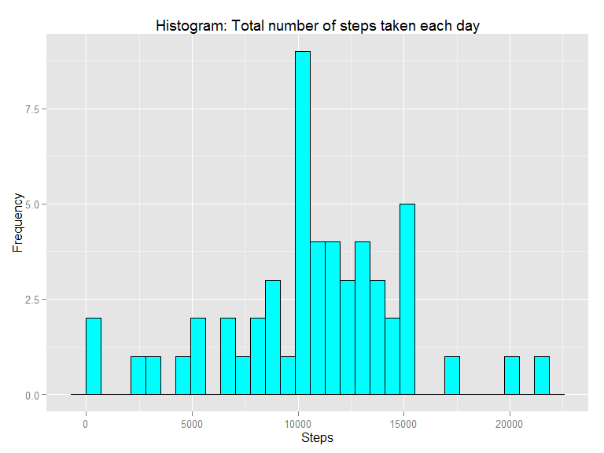
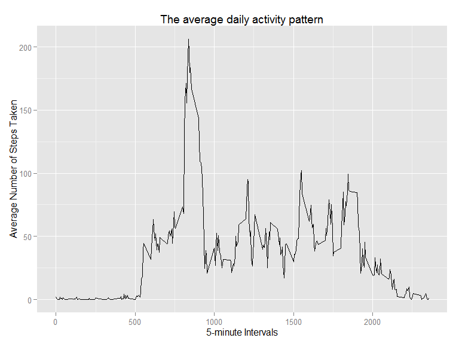
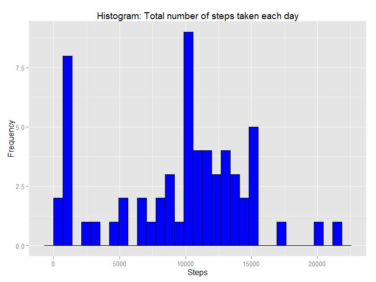
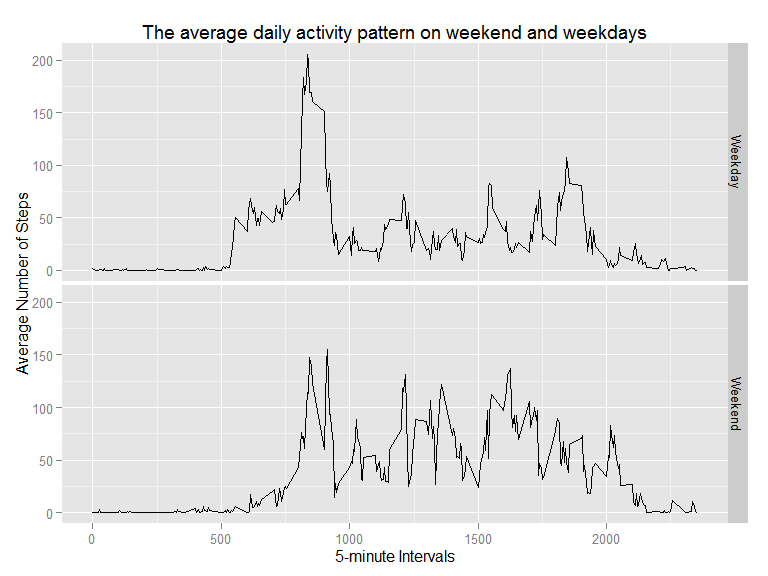

# Reproducible Research: Peer Assessment 1

Load `knitr`, `plyr` and `ggplot2` libraries;

```r
library(knitr)
library(plyr)
library(ggplot2)
```

Set `knitr` figure options; height 6 and width 8.

```r
opts_chunk$set(fig.height = 6, fig.width = 8)
```


## Loading and preprocessing the data

Load data from activity.csv to memory and convert dates to R Date class.

```r
unzip("activity.zip")
activityData <- read.csv("activity.csv", header = TRUE)
activityData$date <- as.Date(activityData$date,"%Y-%m-%d")
```

## What is mean total number of steps taken per day?

1. Split data by day  and compute the total steps for each day.
2. Plot the histogram.
3. Compute mean and median.

Compute total number of steps taken each day.

```r
totalSteps <- ddply(activityData, ~date, summarise, steps = sum(steps))
```

Make a histogram of the total number of steps taken each day

```r
figure1 <- ggplot(totalSteps, aes(steps))
figure1 <- figure1 + geom_histogram(fill = "cyan", color = "black")
figure1 <- figure1 + ggtitle("Histogram: Total number of steps taken each day")
figure1 <- figure1 + xlab("Steps") + ylab("Frequency")
figure1
```

 

Calculate and report the mean and median of the total number of steps taken per day.


```r
meanStepsPerDay <- mean(totalSteps$steps, na.rm = TRUE)
medianStepsPerDay <- median(totalSteps$steps, na.rm = TRUE)
```

Mean number of steps taken each day: **10766.19** steps.

Median number of steps taken each day: **10765** steps.

## What is the average daily activity pattern?

1. Compute the average number of steps taken in 5 minutes interval.
2. Plot 
3. Find maximum value (5 minutes Inteval), and the corresponding interval.

Find the average number of steps taken per 5 minute interval.

```r
avg5min <- ddply(activityData,~interval,summarise, mean = mean(steps, na.rm = T))
```

Make a time series plot of the 5-minute interval (x-axis) and the average number of steps taken, averaged across all days (y-axis)

```r
figure2 <- ggplot(avg5min, aes(interval, mean)) + geom_line()
figure2 <- figure2 + ggtitle("The average daily activity pattern")
figure2 <- figure2 + xlab("5-minute Intervals") + ylab("Average Number of Steps Taken")
figure2
```

 

Find which 5-minute interval that contains the maximum number of steps on average across all the days in the dataset.

```r
maxPoint <- avg5min$interval[which.max(avg5min$mean)]
```

- 5-minute interval containing the maximum number of steps: **835** .

## Imputing missing values


1. Calculate the total number of missing values in the dataset.
2. Replace the NA's with median value.
3. Make histogram
4. Compute mean and median.


**Description of a strategy for imputing missing data:**

1.Compute Median of 5 Minutes interval.

2.Construct a function to replace NA's with the median value.


Calculate the total number of missing values in the dataset.

```r
numNA <- sum(as.numeric(!complete.cases(activityData$steps)))
```

The total number of rows with NA: **2304**

Function for replacing NA's by the `median` of 5 minute interval.


```r
replaceNAFunction <- function(act) {
    ddply(act, ~interval, function(dd) {
        steps <- dd$steps
        dd$steps[is.na(steps)] <- median(steps, na.rm = TRUE)
        dd
    })
}
```

Create a new dataset that is equal to the original dataset but with the missing data filled in.

```r
activityDataWithoutNA <- replaceNAFunction(activityData)
```

Compute total number of steps taken each day.

```r
stepsPerDayWithoutNA <- ddply(activityDataWithoutNA, ~date, summarise, steps = sum(steps))
```

Make a histogram of the total number of steps taken each day.

```r
figure3 <- ggplot(stepsPerDayWithoutNA, aes(steps))
figure3 <- figure3 + geom_histogram(fill = "blue", color = "black")
figure3 <- figure3 + ggtitle("Histogram: Total number of steps taken each day")
figure3 <- figure3 + xlab("Steps") + ylab("Frequency")
figure3
```

 

Calculate and report the mean and median of the total number of steps taken per day.

```r
newMeanStepsPerDay <- mean(stepsPerDayWithoutNA$steps)
newMedianStepsPerDay <- median(stepsPerDayWithoutNA$steps)
```

Mean number of steps taken each day: **9503.869** steps.

Median number of steps taken each day: **10395** steps.


## Are there differences in activity patterns between weekdays and weekends?

Create a new factor variable in the dataset with two levels - "weekday" and "weekend" indicating whether a given date is a weekday or weekend day.

```r
weekFactors <- c("Weekday", "Weekend")
WDayOrWEnd <- function(date) {
    day <- weekdays(date)
    part <- factor("Weekend", weekFactors)
    if (day %in% c("Monday", "Tuesday", "Wednesday", "Thursday", "Friday"))
        part <- factor("Weekday", weekFactors)
    return(part)
}

activityDataWithoutNA$weekpart <- sapply(activityDataWithoutNA$date, WDayOrWEnd)
```

Make a panel plot containing a time series plot of the 5-minute interval (x-axis) and the average number of steps taken, averaged across all weekday days or weekend days (y-axis).

```r
averageSteps <- ddply(activityDataWithoutNA,.(interval, weekpart),summarise,mean = mean(steps))

figure4 <- ggplot(averageSteps, aes(x = interval, y = mean))
figure4 <- figure4 + geom_line() + facet_grid(weekpart ~ ., )
figure4 <- figure4 + ggtitle("The average daily activity pattern on weekend and weekdays")
figure4 <- figure4 + xlab("5-minute Intervals") + ylab("Average Number of Steps")
figure4
```

 
